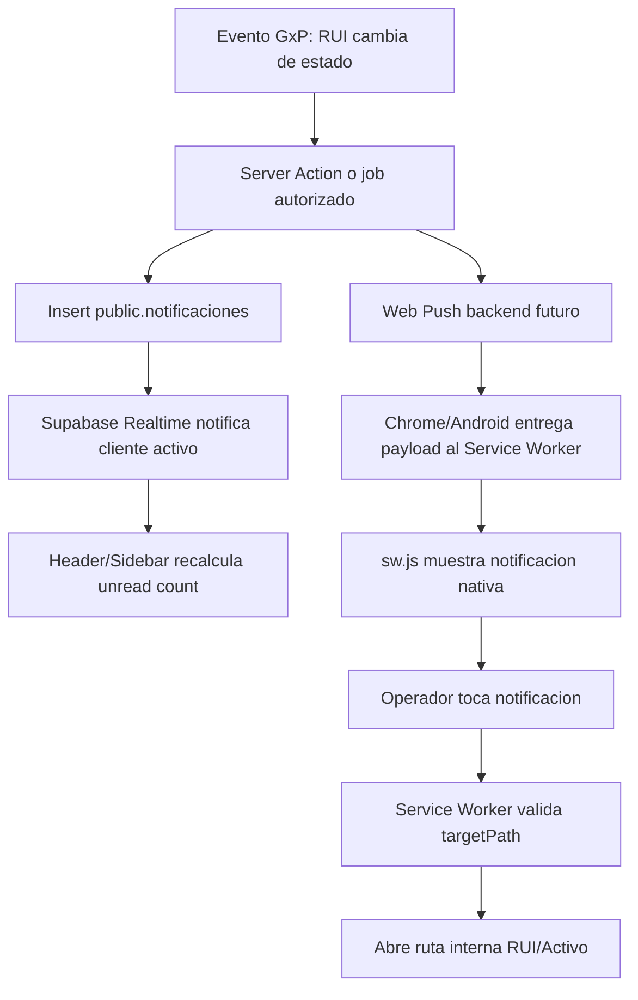

# 15 - Motor de Notificaciones GxP y Web Push

## Objetivo

Definir la arquitectura base para un motor de notificaciones GxP en PharmaOps 360 que combine:

- Notificaciones in-app persistidas en `public.notificaciones`.
- Badge visual de alta visibilidad en header/sidebar para eventos no leidos.
- Arquitectura futura Web Push con Service Worker en `public/sw.js`.

Este documento es un blueprint tecnico. No habilita despliegue, suscripcion push, llaves VAPID, jobs de envio ni migraciones ejecutables.

## Principios GxP

- Atribucion: cada notificacion debe pertenecer a un `user_id` canonico de `auth.users`.
- Trazabilidad: cada evento debe persistir `created_at`, severidad, contexto de rol y referencia opcional a RUI.
- Inmutabilidad critica: una notificacion `critical_gxp` no puede eliminarse fisicamente.
- Minimizacion de acoplamiento: la UI solo consume estados derivados del servidor, no strings sueltos en cliente.
- Seguridad: las rutas de destino de Web Push deben validarse contra allow-list antes de abrir ventanas.
- Ergonomia industrial: el badge debe ser visible, tactil y compatible con WCAG 2.1 AA.

## Esquema Relacional Propuesto

Tabla: `public.notificaciones`

### Enums

```sql
create type public.notification_role_context as enum (
  'technician',
  'supervisor',
  'quality',
  'management'
);

create type public.notification_severity_level as enum (
  'info',
  'warning',
  'critical_gxp'
);
```

### Tabla

```sql
create table public.notificaciones (
  id uuid primary key default gen_random_uuid(),
  user_id uuid not null references auth.users(id) on delete restrict,
  role_context public.notification_role_context not null,
  title text not null check (char_length(trim(title)) between 3 and 120),
  message text not null check (char_length(trim(message)) between 3 and 1000),
  severity_level public.notification_severity_level not null default 'info',
  related_record_code text null,
  is_read boolean not null default false,
  created_at timestamptz not null default now()
);

create index notificaciones_user_unread_created_idx
  on public.notificaciones (user_id, is_read, created_at desc);

create index notificaciones_related_record_code_idx
  on public.notificaciones (related_record_code)
  where related_record_code is not null;

create index notificaciones_critical_gxp_idx
  on public.notificaciones (created_at desc)
  where severity_level = 'critical_gxp';
```

### Politicas RLS Propuestas

```sql
alter table public.notificaciones enable row level security;

create policy "Usuarios leen sus propias notificaciones"
  on public.notificaciones
  for select
  using (auth.uid() = user_id);

create policy "Usuarios marcan como leidas sus propias notificaciones"
  on public.notificaciones
  for update
  using (auth.uid() = user_id)
  with check (
    auth.uid() = user_id
    and is_read = true
  );
```

Las inserciones deberian ejecutarse solo desde Server Actions, RPC seguras o jobs con service role. El cliente no debe crear notificaciones GxP directamente.

### Bloqueo de Hard Delete Critico

```sql
create or replace function public.prevent_critical_gxp_notification_delete()
returns trigger
language plpgsql
as $$
begin
  if old.severity_level = 'critical_gxp' then
    raise exception 'critical_gxp notifications cannot be hard-deleted';
  end if;

  return old;
end;
$$;

create trigger notificaciones_prevent_critical_gxp_delete
before delete on public.notificaciones
for each row
execute function public.prevent_critical_gxp_notification_delete();
```

Regla de cumplimiento:

- `critical_gxp` solo admite lectura, marcado como leida y archivo logico futuro.
- No se permite `delete` fisico para eventos criticos.
- Si se requiere retencion adicional, agregar una tabla `public.notificaciones_audit_events` antes de habilitar produccion.

## Tipos TypeScript Derivados

```ts
export type NotificationRoleContext =
  | 'technician'
  | 'supervisor'
  | 'quality'
  | 'management';

export type NotificationSeverityLevel = 'info' | 'warning' | 'critical_gxp';

export type GxpNotification = {
  id: string;
  user_id: string;
  role_context: NotificationRoleContext;
  title: string;
  message: string;
  severity_level: NotificationSeverityLevel;
  related_record_code: string | null;
  is_read: boolean;
  created_at: string;
};
```

## Service Worker Web Push

Archivo futuro: `public/sw.js`

Responsabilidades:

- Escuchar eventos `push`.
- Parsear payload JSON firmado por backend.
- Mostrar notificacion nativa de Chrome/Android PWA.
- Mantener `tag`, `recordCode`, `targetPath` y `severityLevel` en `notification.data`.
- En click, enrutar a una ruta permitida y enfocar una pestana existente si ya esta abierta.

### Contrato de Payload

```json
{
  "notificationId": "uuid",
  "title": "RUI pendiente de revision",
  "message": "HVAC-02 requiere validacion de supervisor.",
  "severityLevel": "warning",
  "roleContext": "supervisor",
  "relatedRecordCode": "WO-HVAC-2026-020",
  "targetPath": "/mantenimiento/hvac/rui/activo/WO-HVAC-2026-020",
  "tag": "rui-WO-HVAC-2026-020-supervisor"
}
```

### Parser y Routing Conceptual

```js
self.addEventListener('push', (event) => {
  const payload = event.data ? event.data.json() : {};
  const targetPath = sanitizeTargetPath(payload.targetPath);

  event.waitUntil(
    self.registration.showNotification(payload.title, {
      body: payload.message,
      tag: payload.tag,
      renotify: payload.severityLevel === 'critical_gxp',
      requireInteraction: payload.severityLevel === 'critical_gxp',
      data: {
        notificationId: payload.notificationId,
        relatedRecordCode: payload.relatedRecordCode,
        severityLevel: payload.severityLevel,
        targetPath,
      },
    }),
  );
});

self.addEventListener('notificationclick', (event) => {
  event.notification.close();

  const targetPath = sanitizeTargetPath(event.notification.data?.targetPath);

  event.waitUntil(
    clients.matchAll({ type: 'window', includeUncontrolled: true }).then((clientList) => {
      const targetUrl = new URL(targetPath, self.location.origin).href;
      const existingClient = clientList.find((client) => client.url === targetUrl);

      if (existingClient) {
        return existingClient.focus();
      }

      return clients.openWindow(targetPath);
    }),
  );
});
```

### Allow-list de Rutas Push

La funcion conceptual `sanitizeTargetPath` debe aceptar solo rutas internas:

- `/dashboard`
- `/mantenimiento/hvac/rui/activo`
- `/mantenimiento/hvac/rui/activo/[id]`
- `/mantenimiento/hvac/rui/enviado`
- `/mantenimiento/hvac/rui/rechazado`
- `/mantenimiento/hvac/rui/ht`
- `/activos/hvac/ver/[uuid]`

Debe rechazar:

- URLs absolutas externas.
- Protocolos como `javascript:`.
- Rutas sin prefijo permitido.
- Parametros no esperados en eventos GxP criticos.

## Badge Header/Sidebar

Ubicacion UI actual:

- Header global: `src/modules/common/components/app-shell.tsx`
- Sidebar global: `src/modules/common/components/sidebar.tsx`

### Consulta Inicial

```ts
const { count } = await supabase
  .from('notificaciones')
  .select('id', { count: 'exact', head: true })
  .eq('user_id', currentUserId)
  .eq('is_read', false);
```

### Realtime

Canal sugerido:

```ts
supabase
  .channel(`notificaciones:${currentUserId}`)
  .on(
    'postgres_changes',
    {
      event: '*',
      schema: 'public',
      table: 'notificaciones',
      filter: `user_id=eq.${currentUserId}`,
    },
    () => refetchUnreadCount(),
  )
  .subscribe();
```

Reglas:

- El badge incrementa solo si `is_read === false`.
- El filtro siempre debe estar atado a `user_id` de la sesion activa.
- El contador debe recalcular desde servidor/realtime, no confiar en incremento local para eventos GxP.
- El badge `critical_gxp` puede usar estilo diferenciado, pero el conteo base sigue siendo unread total.

### Estilo Visual

```tsx
<span className="absolute right-1 top-1 min-h-5 min-w-5 rounded-full bg-red-700 px-1.5 text-center text-[11px] font-black leading-5 text-white ring-2 ring-white">
  {unreadCount}
</span>
```

Ergonomia:

- Minimo tactil recomendado: 44px para el boton contenedor.
- Contraste alto: rojo oscuro sobre blanco.
- No ocultar badge en mobile.
- Mantener header fijo para screenshots ALCOA+ con identidad visible.

## Flujo Mermaid



## Riesgos y Controles

- Riesgo: payload push manipulado.
  Control: allow-list estricta de rutas y payload firmado desde backend.

- Riesgo: eliminacion fisica de eventos criticos.
  Control: trigger `prevent_critical_gxp_notification_delete`.

- Riesgo: contador inconsistente por eventos concurrentes.
  Control: recalculo del count contra Supabase, no acumulador local.

- Riesgo: notificaciones creadas desde cliente.
  Control: RLS sin policy de insert para usuarios finales.

- Riesgo: exposicion de datos sensibles en push nativo.
  Control: titulo y mensaje no deben incluir datos personales sensibles ni mediciones reguladas completas; el detalle vive en la ruta autenticada.

## Pendientes Antes de Implementar

- Definir tabla de suscripciones push: `public.web_push_subscriptions`.
- Definir llaves VAPID y custodia de secretos.
- Crear RPC o Server Action de emision controlada.
- Definir politica de retencion de notificaciones no criticas.
- Agregar auditoria de lectura: quien marco como leida y cuando.
- Validar soporte de PWA instalada en tablets objetivo.
