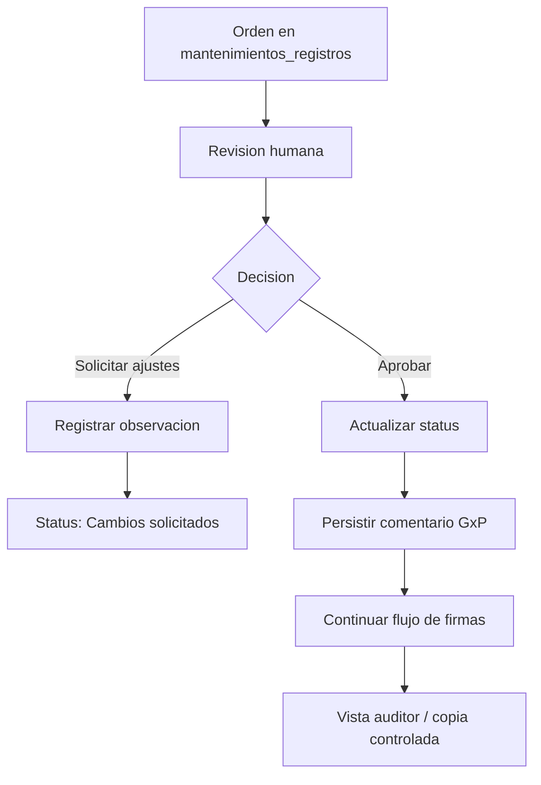

# Modulo de Workflow de Aprobaciones

## Objetivo

Documentar el proceso de aprobacion humana de ordenes de mantenimiento registradas en `mantenimientos_registros`.

## Reglas GxP

- Las aprobaciones requieren accion humana explicita.
- El estado transaccional se controla mediante la columna `status`.
- No se automatizan firmas ni aprobaciones.
- Toda observacion debe conservar trazabilidad en el registro correspondiente.
- Las observaciones de aprobacion se persisten en `mantenimientos_registros.notes.gxp_workflow_comments`.
- Las copias controladas se auditan con `PRINT_CONTROLLED_COPY` y contador de impresion.

## Diagrama de Flujo

## Uso Basico

1. Tecnico completa checklist y evidencias.
2. Supervisor revisa y firma con comentario GxP.
3. Calidad libera o rechaza con dictamen documentado.
4. Gerencia cierra cuando aplique.
5. Auditor externo consulta solo expedientes cerrados desde `/auditoria`.
6. Cualquier impresion regulada debe pasar por `/mantenimiento/imprimir/[id]`.
