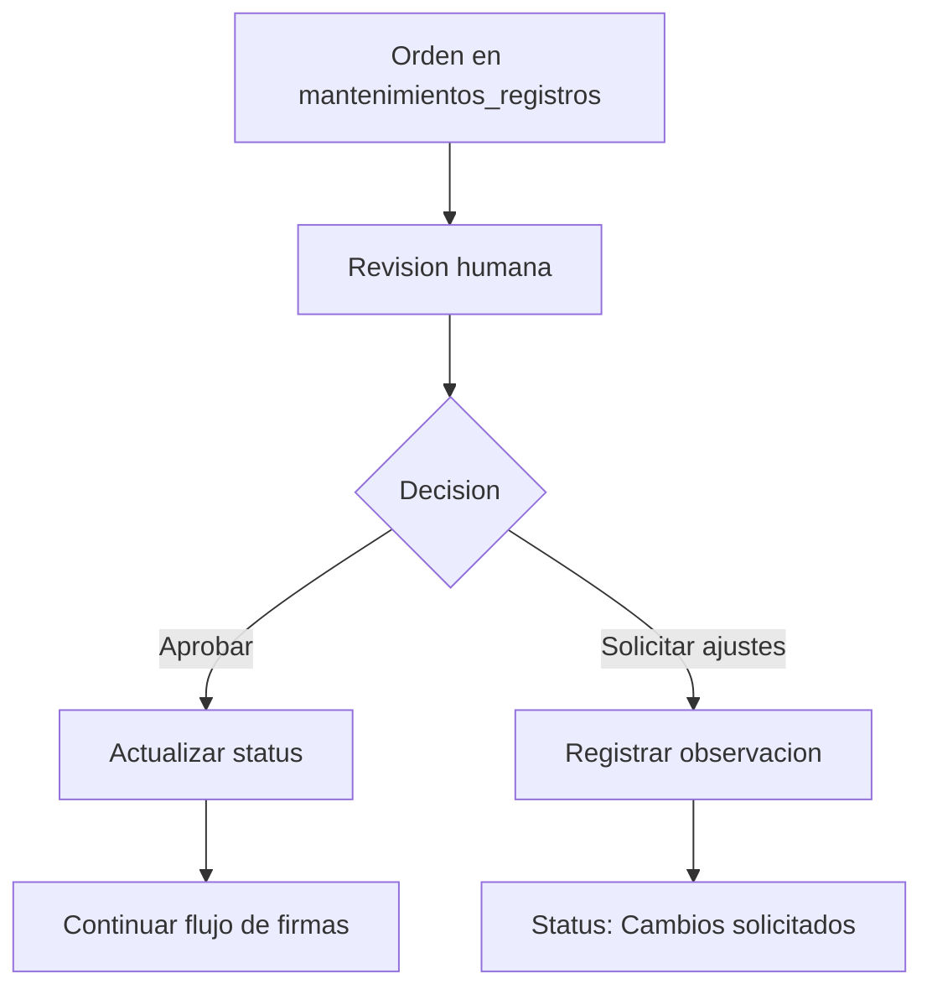

# Modulo de Workflow de Aprobaciones

## Objetivo

Documentar el proceso de aprobacion humana de ordenes de mantenimiento registradas en `mantenimientos_registros`.

## Reglas GxP

- Las aprobaciones requieren accion humana explicita.
- El estado transaccional se controla mediante la columna `status`.
- No se automatizan firmas ni aprobaciones.
- Toda observacion debe conservar trazabilidad en el registro correspondiente.

## Diagrama de Flujo

